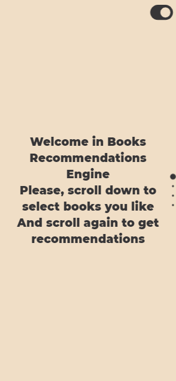

[![Contributors][contributors-shield]][contributors-url]
[![Forks][forks-shield]][forks-url]
[![Stargazers][stars-shield]][stars-url]
[![Issues][issues-shield]][issues-url]
[![MIT License][license-shield]][license-url]


<br />
<p align="center">

  <h3 align="center">What To Read</h3>

  <p align="center">
    Single Page Application designed to help you find a book to read having books you have read before.<br /> 
    Based on <a href=https://en.wikipedia.org/wiki/Collaborative_filtering> Collaborative filtering</a> technique
    <br />
    <!-- <a href="https://github.com/dimamik/what-to-read"><strong>Explore the docs »</strong></a>
    <br /> -->
    <br />
    <!-- <a href="http://books-searcher.duckdns.org/">View Demo</a> -->
    <!-- · -->
    <a href="https://github.com/dimamik/what-to-read/issues">Report Bug</a>
    ·
    <a href="https://github.com/dimamik/what-to-read/issues">Request Feature</a>
  </p>
</p>


<p align="center">
  
</p>

<!-- TABLE OF CONTENTS -->
<details open="open">
  <summary><h2 style="display: inline-block">Table of Contents</h2></summary>
  <ol>
    <li>
      <a href="#project-structure">Project Structure</a>
    </li>
    <li>
      <a href="#built-with">Build With</a>
    </li>
    <li>
      <a href="#getting-started">Getting Started</a>
      <ul>
        <li><a href="#prerequisites">Prerequisites</a></li>
        <li><a href="#installation">Installation</a></li>
      </ul>
    </li>
    <li><a href="#usage">Usage</a></li>
    <li><a href="#roadmap">Roadmap</a></li>
    <li><a href="#contributing">Contributing</a></li>
    <li><a href="#license">License</a></li>
    <li><a href="#contact">Contact</a></li>
    <!-- <li><a href="#acknowledgements">Acknowledgements</a></li> -->
  </ol>
</details>


<!--  -->

## Project Structure
<pre>
├── nginx - reversed proxy
├── ui - React Front
├── rec_api - REST API server handling recommendations
├── search_api - REST API server handling books searching
└── img - images for Readme.md
</pre>

## Built With

* Front - [React](https://reactjs.org/)
* Back - [Python Flask](https://flask.palletsprojects.com/en/2.0.x/)
* Database - [Elasticsearch](https://www.elastic.co/)
* Web Server Interface - [UWSGI](https://uwsgi-docs.readthedocs.io/en/latest/)
* Reversed proxy - [NGINX](https://www.nginx.com/)
* Docker-compose


<!-- GETTING STARTED -->
## Getting Started

To get a local copy up and running follow these simple steps.

### Prerequisites

`docker-compose` and `git` installed on server with open ip adress and ports `80,5000,5001`

### Installation

1. Clone the repo
   ```sh
   git clone https://github.com/dimamik/what-to-read.git
   ```
2. Run docker-compose
   ```sh
   cd what-to-read
   docker-compose up --build
   ```


<!-- ROADMAP -->
## Roadmap

See the [open issues](https://github.com/dimamik/what-to-read/issues) for a list of proposed features (and known issues).


<!-- CONTRIBUTING -->
## Contributing

Contributions are what make the open source community such an amazing place to learn, inspire, and create. Any contributions you make are **greatly appreciated**.

1. Fork the Project
2. Create your Feature Branch (`git checkout -b feature/AmazingFeature`)
3. Commit your Changes (`git commit -m 'Add some AmazingFeature'`)
4. Push to the Branch (`git push origin feature/AmazingFeature`)
5. Open a Pull Request


<!-- LICENSE -->
## License

Distributed under the GPL-3.0.    
See `LICENSE` for more information.


<!-- CONTACT -->
## Contact


Project Link: [https://github.com/dimamik/what-to-read](https://github.com/dimamik/what-to-read)


<!-- ACKNOWLEDGEMENTS -->
<!-- ## Acknowledgements

* []()
* []()
* []() -->


<!-- MARKDOWN LINKS & IMAGES -->
<!-- https://www.markdownguide.org/basic-syntax/#reference-style-links -->
[contributors-shield]: https://img.shields.io/github/contributors/dimamik/what-to-read?style=for-the-badge
[contributors-url]: https://github.com/dimamik/what-to-read/graphs/contributors
[forks-shield]: https://img.shields.io/github/forks/dimamik/what-to-read?style=for-the-badge
[forks-url]: https://github.com/dimamik/what-to-read/network/members
[stars-shield]: https://img.shields.io/github/stars/dimamik/what-to-read?style=for-the-badge
[stars-url]: https://github.com/dimamik/what-to-read/stargazers
[issues-shield]: https://img.shields.io/github/issues/dimamik/what-to-read?style=for-the-badge
[issues-url]: https://github.com/dimamik/what-to-read/issues
[license-shield]: https://img.shields.io/github/license/dimamik/what-to-read?style=for-the-badge
[license-url]: https://github.com/dimamik/what-to-read/blob/master/LICENSE
